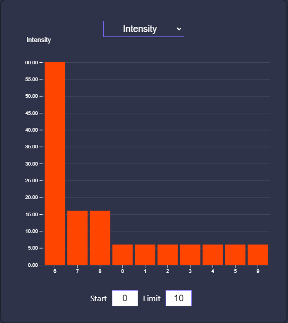
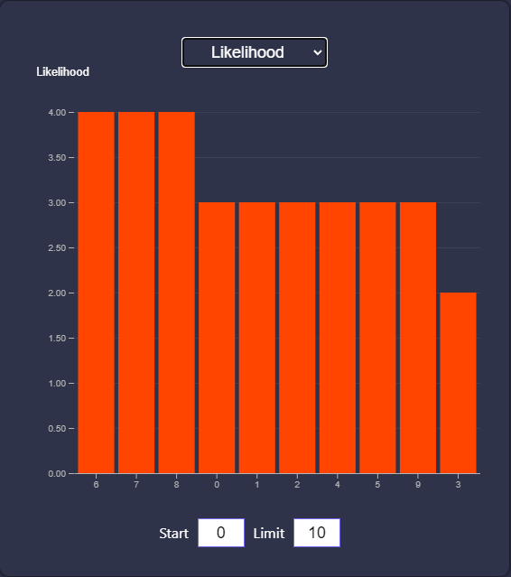
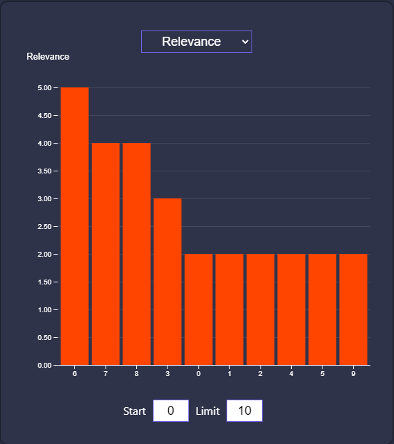
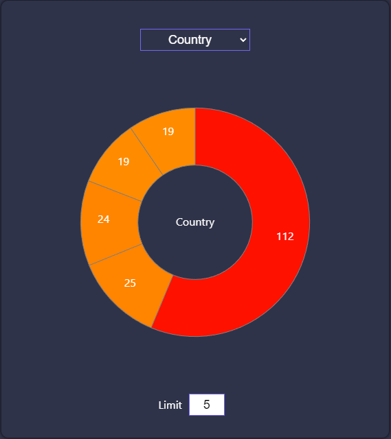
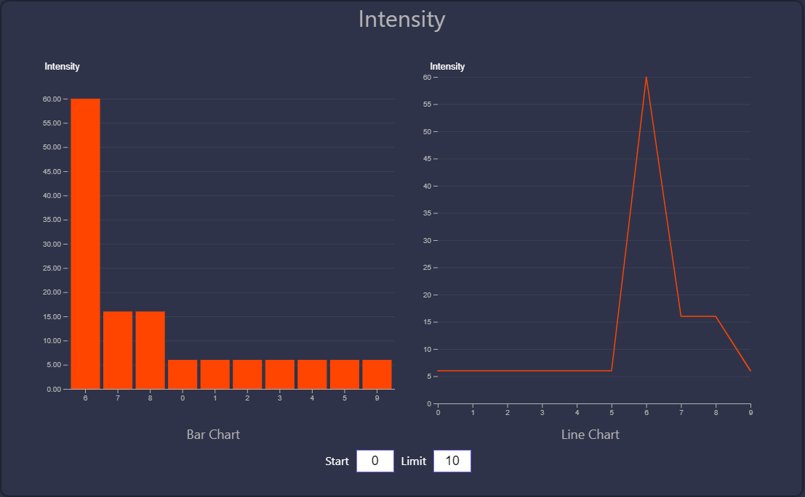
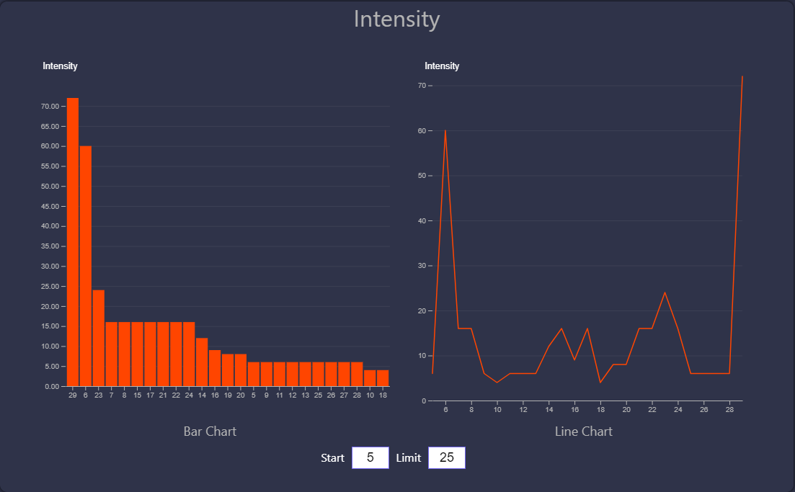

# Dashboard

[](https://pypi.org/project/Flask/)
[](https://pypi.org/project/waitress/)
[](https://www.postgresql.org/)
[](https://pypi.org/project/flask-sqlalchemy/)
[](https://reactjs.org/)
[](https://www.npmjs.com/package/react-d3-library)
[](./LICENCE)
[](https://pypi.org/project/black/)


This dashboard is built with flask and ReactJS frameworks. Data used in this project is private and won't be shared.

## Samples


### Barcharts





```
Intensity variables
Likelihood variables
Relevance variables
```

### Linechart and Piechart


```
Dropdown menu provides access to intensity, likelihood, and relevance.
```



```
Dropdown menu provides access to other variables.
```

### Barchart + Linechart




```
Dropdown menu provides access to intensity, likelihood, and relevance.
Default: Displays 10 elements starting from 0th
Custom: Displays 25 elements starting from 5th
```

### LICENCE

MIT License

Copyright (c) 2023 Yashodhan Ketkar